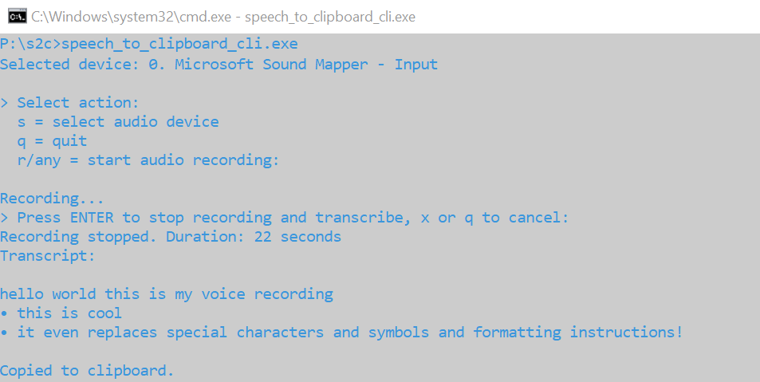
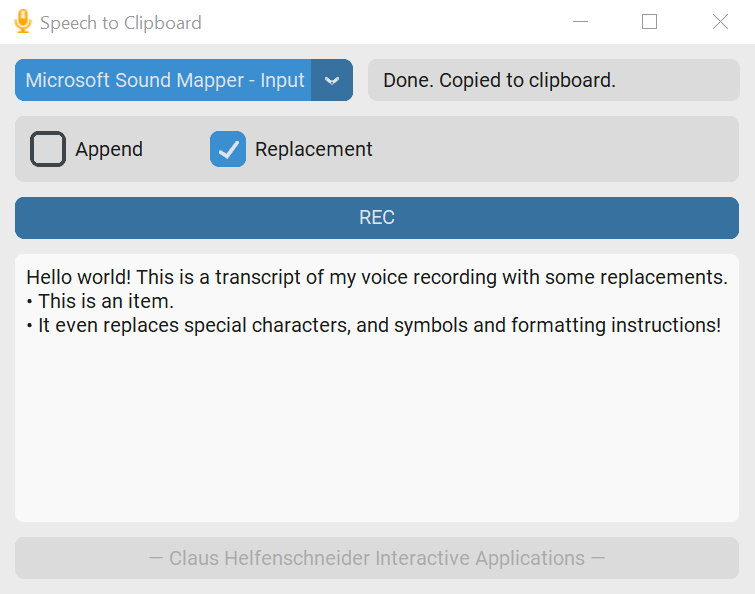

<h1 align="center">Speech To Clipboard</h1>

<p align="center">
    <a href="https://github.com/clausmeister/whisper-clip"></a>
    <a href="https://github.com/clausmeister/whisper-clip"></a>
    <a href="https://github.com/clausmeister/whisper-clip"></a>
    <a href="https://www.buymeacoffee.com/interactiveapplications"></a>
</p>

A tool for **recording audio from a microphone and automatically transcribing the recording** using OpenAI's *Whisper* model via OpenAI's API. The **transcription is copied to the clipboard** for easy pasting into other applications. 

It comes with a **command line interface** with different modes (interactive, verbose, silent, one-shot) as well as with a **UI**. It can also be used as a **module** in other Python projects.

The tool also **supports simple configurable text replacements**, similar to the voice recording feature on iOS. For example, it can replace the text "new line" with an actual new line or "bullet point" with "`• `".

Written in Python. 
Developed by [Claus Helfenschneider Interactive Applications](https://interactive-applications.com).

| CLI | UI |
|--|--|
| Verbose Mode:<br><br>Silent Mode:<br> |  |


## Installation

1. Clone the repository.
1. (Optional but recommended) Set up a virtual environment. Requires **Python 3.11** or higher.
1. Install the requirements:
    - `pip install -r requirements.in` for the latest versions (recommended), or
    - `pip install -r requirements.txt` for pinned versions.
1. To build an `.exe`, install the dev requirements:
    - `pip install -r requirements-dev.in`
1. Set the environment variable `WHISPER_KEYBOARD_API_KEY` to your OpenAI API Key. You can either set it in your global environment, add it to an `.env` file or specify it in the [config.ini](resources/config.ini) file under `[openai] api_key`.
    - **Note:** An environment variable takes precedence over the value set in the config file.

## Usage

### CLI (Command Line Interface)

1. Run the command line interface: `python speech_to_clipboard_cli.py`
1. For available options, run `python speech_to_clipboard_cli.py --help`.

### UI (User Interface)
1. Run the UI: `python speech_to_clipboard_ui.pyw`
1. Select your preferred microphone from the dropdown menu.
1. Press **REC** to start recording.
1. Press **Stop Recording** to end the recording. The audio will be sent to the OpenAI API for transcription, and the result will be copied to your clipboard.

### Python Module

```python
from settings import Settings
from core.speech_to_clipboard import SpeechToClipboard

speech_to_clip = SpeechToClipboard(
    audio_file_path=Settings.AUDIO_FILE_PATH,
    config_file_path=Settings.CONFIG_FILE_PATH,
    replacemetns_file_path=Settings.REPLACEMENTS_FILE_PATH,
    openai_api_key_env_var=Settings.OPENAI_API_KEY_ENV_VAR,
)

speech_to_clip.start_recording()
print("Recording...")
input("Press Enter to stop recording...")
speech_to_clip.stop_and_save_recording()
transcription = speech_to_clip.transcribe_recording()
print(transcription)
```

## Create Executable With AutoPyToExe

To build an executable file (`.exe` on *Windows*) using [AutoPyToExe](https://github.com/brentvollebregt/auto-py-to-exe), follow these steps:

1. Install the dev requirements: `pip install -r requirements-dev.in`
1. Depending on whether you want to build the UI or the CLI app, choose the corresponding configuration file:
    - UI: [auto-py-to-exe-config_ui.json](auto-py-to-exe-config_ui.json)
    - CLI: [auto-py-to-exe-config_cli.json](auto-py-to-exe-config_cli.json)
1. There are some absolute paths in the configuration file, which have to be replaced by the path to your local project. Alternatively you can just take the config file as a reference to adjust the settings in the UI.
1. Execute `auto-py-to-exe -c <YOUR_CONFIG_FILE>` with the adjusted config file.
1. Click **Convert .py to .exe*
1. Note: In case you want to build UI and CLI, you need to build those separately, but after building both, you can move both excutables into the same directory, so that they use the same config file and resources, and delete the other/obsolete build directory.

## Text Replacer

The tool features a simple text replacement system. When enabled via the **Replacer** checkbox, it can replace certain expressions as follows:

| Expression    | Replacement |
|---------------|-------------|
| `new line`    | `\n`        |
| `bullet point`| `• `        |
| `en dash`     | `–`         |
| ...           | ...         |

Configure or edit the replacements in the [resources/replacements.json](resources/replacements.json) file.

## Contributions & Feedback

Contributions and feedback are welcome! Please open an issue or submit a pull request.

## Credits

By Claus Helfenschneider Interactive Applications @ [www.interactive-applications.com](https://interactive-applications.com)

If you enjoy this project, please consider [buying me a coffee](https://www.buymeacoffee.com/interactiveapplications), check out my [website](https://interactive-applications.com), and reach out to me. I'd love to hear from you! 

**I am open for hire/commissions.**

## License

This project is licensed under the MIT License. See the [LICENSE](LICENSE) file for details.

## Third-Party Licenses

This project uses the following third-party packages. Please refer to the respective license files for more details.

| Package | License | License File |
| ------- | ------- | ------------ |
| [CustomTKinter](https://github.com/TomSchimansky/CustomTkinter) | MIT | [Link](https://github.com/TomSchimansky/CustomTkinter/blob/master/LICENSE) |
| [OpenAI](https://github.com/openai/openai-python) | MIT | [Link](https://github.com/openai/openai-python/blob/main/LICENSE) |
| [python-sounddevice](https://github.com/spatialaudio/python-sounddevice) | MIT | [Link](https://github.com/spatialaudio/python-sounddevice/blob/master/LICENSE) |
| [python-soundfile](https://github.com/bastibe/python-soundfile) | BSD-3-Clause | [Link](https://github.com/bastibe/python-soundfile/blob/master/LICENSE) |
| [numpy](https://github.com/numpy/numpy) | BSD-3-Clause | [Link](https://github.com/numpy/numpy/blob/main/LICENSE.txt) |
| [pyperclip](https://github.com/asweigart/pyperclip) | BSD-3-Clause | [Link](https://github.com/asweigart/pyperclip/blob/master/LICENSE.txt) |
| [pydub](https://github.com/jiaaro/pydub) | MIT | [Link](https://github.com/jiaaro/pydub/blob/master/LICENSE) |
| [humanize](https://github.com/python-humanize/humanize) | MIT | [Link](https://github.com/python-humanize/humanize/blob/main/LICENCE) |
| [auto-py-to-exe](https://github.com/brentvollebregt/auto-py-to-exe) | MIT | [Link](https://github.com/brentvollebregt/auto-py-to-exe/blob/master/LICENSE) |

Development dependencies:

| Package | License | License File |
| ------- | ------- | ------------ |
| [pylint](https://github.com/pylint-dev/pylint) | GPL-2.0-or-later | [Link](https://github.com/pylint-dev/pylint/blob/main/LICENSE)
| [yapf](https://github.com/google/yapf) | Apache-2.0 | [Link](https://github.com/google/yapf/blob/main/LICENSE) |
